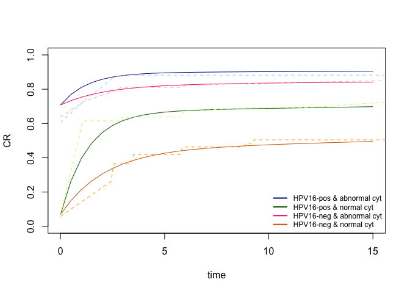

<!-- README.md is generated from README.Rmd. Please edit that file -->

# PICmodel

<!-- badges: start -->
<!-- badges: end -->

This `R` package fits prevalence-incidence-clearance (PIC) models to
interval-censored data to estimate the cumulative disease risk in a
population with a temporarily elevated risk of disease, e.g., risk of
CIN2+ in HPV-positive women.

In longitudinal screening studies it is possible to observe prevalent,
early or late events during follow-up. In our model, early events are
modelled via a competing risks framework, infections either progress to
the disease state or to a (latent) “cure” state (i.e. viral clearance)
at constant rates. Late events are modelled by adding background risk to
the model. Parameters can depend on individual risk factors and are
estimated with an expectation-maximisation (EM) algorithm with weakly
informative Cauchy priors. More details are given in the accompanying
paper: *eventual link to paper*.

There are five main functions in this package:

- `PICmodel.fit`: fits our Prevalence-Incidence-Cure model
- `PICmodel.predict`: makes predictions from the model
- `PICmodel.simulator`: simulates data under user-specified parameter
  values and covariates
- `score.test.gamma`: performs a score test whether the shape parameter
  of the Gamma distribution for progression is equal to one or not.
- `simulator.gamma`: simulates data where progression follows a Gamma
  rather than exponential distribution and so can have a shape parameter
  not equal to one. Does not allow for covariates, yet.

## Installation

You can install the most recent version of `PICmodel` from
[GitHub](https://github.com/) with:

``` r
# install.packages("devtools")
devtools::install_github("kelsikroon/PICmodel")
```

## Examples

This is a basic example in a setting without covariates which
illustrates how to simulate data, fit the model, make predictions from
the plot and compare to a non-parametric cumulative incidence curve:

``` r
library(PICmodel)
sim.thetas <- c(-5, -1.6, -1.2, -3)
sim.dat <- PICmodel.simulator(1000, c(), c(), c(), sim.thetas, show_prob = 0.9, interval=3, include.h=T)
head(sim.dat) # view simulated data
#>       left     right z      age     age.std hpv cyt cause      actual
#> 1 23.93008       Inf 0 39.20837 -0.46567478   0   1     3  25.3322721
#> 2 23.70617       Inf 0 49.35929 -0.01966284   0   0     3 213.1513153
#> 3  0.00000  2.870138 0 65.08876  0.67146005   0   1     2   0.1278914
#> 4 15.05163 18.121568 0 47.19246 -0.11486908   0   0     3  15.6220568
#> 5  0.00000  0.000000 1 69.03762  0.84496557   0   0     1   0.0000000
#> 6 23.76392       Inf 0 42.57620 -0.31769854   1   0     3 346.0784502

sim.fit <- PICmodel.fit(c(), c(), c(), sim.dat) # fit model to simulated data
sim.fit$summary # view model fit summary
#>        param theta.hat std.dev   lower   upper
#> h          h   -4.9354  0.1462 -5.2220 -4.6489
#> g0 intercept   -1.6305  0.0849 -1.7969 -1.4641
#> w0 intercept   -1.1896  0.1005 -1.3865 -0.9926
#> p0 intercept   -3.1413  0.1693 -3.4732 -2.8095

sim.predict <- PICmodel.predict(data=sim.dat[1,], time.points = seq(0, 15, 0.5), fit=sim.fit)

library(survival) # compare model fit to non-parametric Kaplan-Meier curve 
sim.km.fit <- survfit(Surv(sim.dat$left, sim.dat$right, type='interval2')~1)

# plot PICmodel predictions and KM-curve to compare 
plot(sim.predict[[1]]$Time, sim.predict[[1]]$CR, type='l', xlab='time', ylab='CR', ylim=c(0.2, 0.65))
lines(sim.km.fit$time, 1-sim.km.fit$surv, col='blue')
```


To add covariates to the model we specify them separately for the
progression, clearance, and prevalence parameters. For example if we
wanted to add HPV16 as a covariate for progression and abnormal cytology
as a covariate for prevalence then we would d the following:

``` r

sim.thetas.cov <- c(-5, -1.6, 1, -1.2, -3, 4)
sim.dat2 <- PICmodel.simulator(1000, c("hpv"), c(), c("cyt"), sim.thetas.cov, show_prob = 0.9, interval=3, include.h=T)
head(sim.dat2) # view simulated data
#>       left    right  z      age    age.std hpv cyt cause      actual
#> 1  0.00000 3.020843 NA 59.68263  0.3822252   0   0     2   2.3822729
#> 2 23.88299      Inf  0 68.78988  0.7748872   0   1     3  56.6994288
#> 3 24.17573      Inf  0 32.31065 -0.7979259   0   0     3  93.5257920
#> 4 23.49904      Inf  0 68.91464  0.7802662   0   1     3 326.3057599
#> 5 24.47878      Inf  0 65.31513  0.6250723   1   0     3 186.9925219
#> 6  0.00000 3.207084  0 63.81941  0.5605839   1   0     2   0.2103087

sim.fit2 <- PICmodel.fit(c("hpv"), c(), c("cyt"), sim.dat2) # fit model to simulated data
sim.fit2$summary # view model fit summary
#>        param theta.hat std.dev   lower   upper
#> h          h   -4.9675  0.1894 -5.3387 -4.5963
#> g0 intercept   -1.4729  0.1089 -1.6864 -1.2595
#> g1       hpv    0.8566  0.1513  0.5601  1.1532
#> w0 intercept   -1.2013  0.1154 -1.4275 -0.9751
#> p0 intercept   -3.2644  0.2329 -3.7209 -2.8079
#> p1       cyt    4.4758  0.2622  3.9619  4.9897

sim.predict2 <- PICmodel.predict(data=data.frame(hpv = c(1, 1, 0, 0), cyt=c(1, 0, 1, 0)), 
                              time.points = seq(0, 15, 0.5), fit=sim.fit2)

# compare model fit to non-parametric Kaplan-Meier curve 
sim.km.fit1 <- survfit(Surv(left, right, type='interval2')~1, data = sim.dat2[sim.dat2$hpv==1 & sim.dat2$cyt==1,])
sim.km.fit2 <- survfit(Surv(left, right, type='interval2')~1, data = sim.dat2[sim.dat2$hpv==1 & sim.dat2$cyt==0,])
sim.km.fit3 <- survfit(Surv(left, right, type='interval2')~1, data = sim.dat2[sim.dat2$hpv==0 & sim.dat2$cyt==1,])
sim.km.fit4 <- survfit(Surv(left, right, type='interval2')~1, data = sim.dat2[sim.dat2$hpv==0 & sim.dat2$cyt==0,])
```

``` r
# plot PICmodel predictions and KM-curve to compare 
plot(sim.predict2[[1]]$Time, sim.predict2[[1]]$CR, type='l', xlab='time', ylab='CR', ylim=c(0,1), col='darkblue')
lines(sim.km.fit1$time, 1-sim.km.fit1$surv, col='lightblue', lty=2)

lines(sim.predict2[[2]]$Time, sim.predict2[[2]]$CR, col = 'darkgreen')
lines(sim.km.fit2$time, 1-sim.km.fit2$surv, col='darkolivegreen1', lty=2)

lines(sim.predict2[[3]]$Time, sim.predict2[[3]]$CR,col='deeppink2')
lines(sim.km.fit3$time, 1-sim.km.fit3$surv, col='pink1', lty=2)

lines(sim.predict2[[4]]$Time, sim.predict2[[4]]$CR, col='darkorange3')
lines(sim.km.fit4$time, 1-sim.km.fit4$surv, col='orange1', lty=2)

legend("bottomright",
         legend=c("HPV16-pos & abnormal cyt", "HPV16-pos & normal cyt", "HPV16-neg & abnormal cyt", "HPV16-neg & normal cyt"),
         col=c("darkblue", "darkgreen", "deeppink2", "darkorange3"), lty=1, lwd=2, bty = "n", cex=0.75)
```



## Authors

- **Kelsi R. Kroon** <k.kroon@amsterdamumc.nl>
